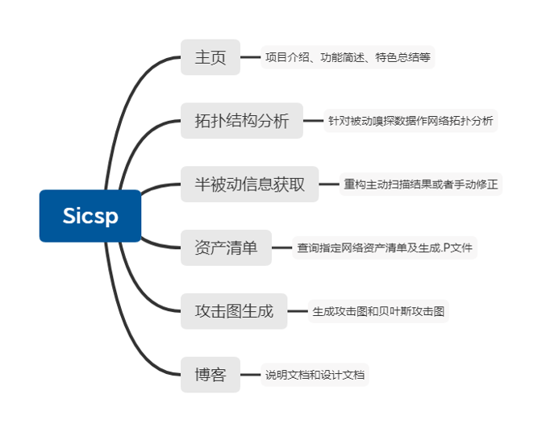
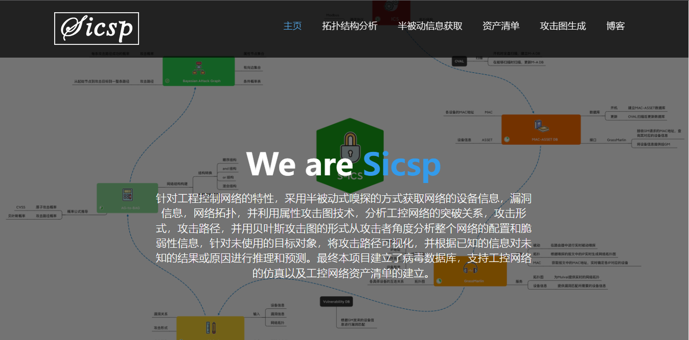
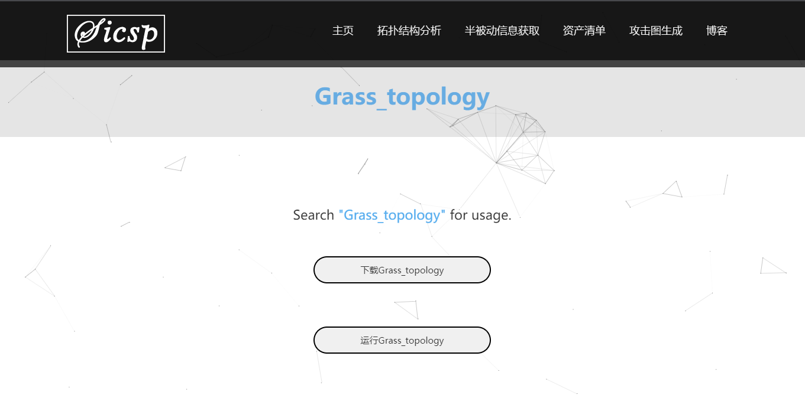
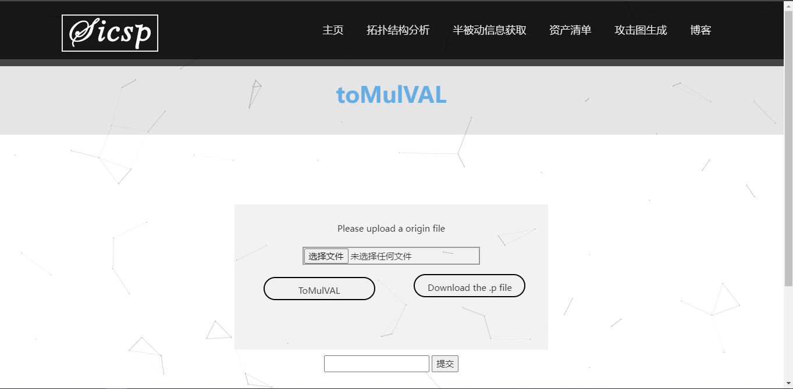

# Sicsp-Web

This project aimed at the safety of the industrail control system. This repo is a user-oriented django web project. This repo need to be used with the support of the [Sicsp_ICS](https://github.com/JianmingGuo/Sicsp_ICS).

The web structure can be shown by the flowchart followed.

## 主页

The home page is a brief introduction to the project overview, instructions and our team.

## 拓扑结构分析

In this page, the user can luanch the locally installed Grass to complete network topology analysis and update effective information into asset list in real time.

## 半被动信息获取

In this page, the user can upload the result of active scanning tools like nessus. After parsing the reevant information and combining with the existing information in the asset list, the user can download the .P file to generate AG/BAG in the next steps.

## 攻击图生成

In this page, the user can genrate the AG based on the .P file and generate the BAG after specifying the target attack node. The user can download the PDF file and can also preview the graph in the web.

## 博客

In this page, our team members will update the design documention, usage documentation and blogs(maybe).

